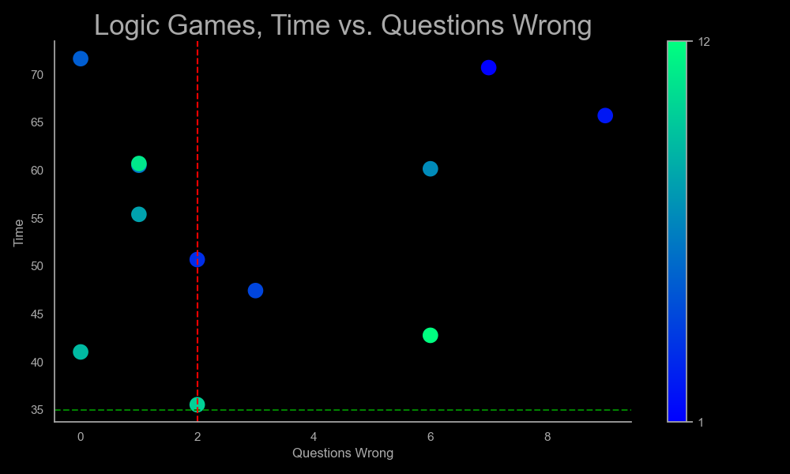
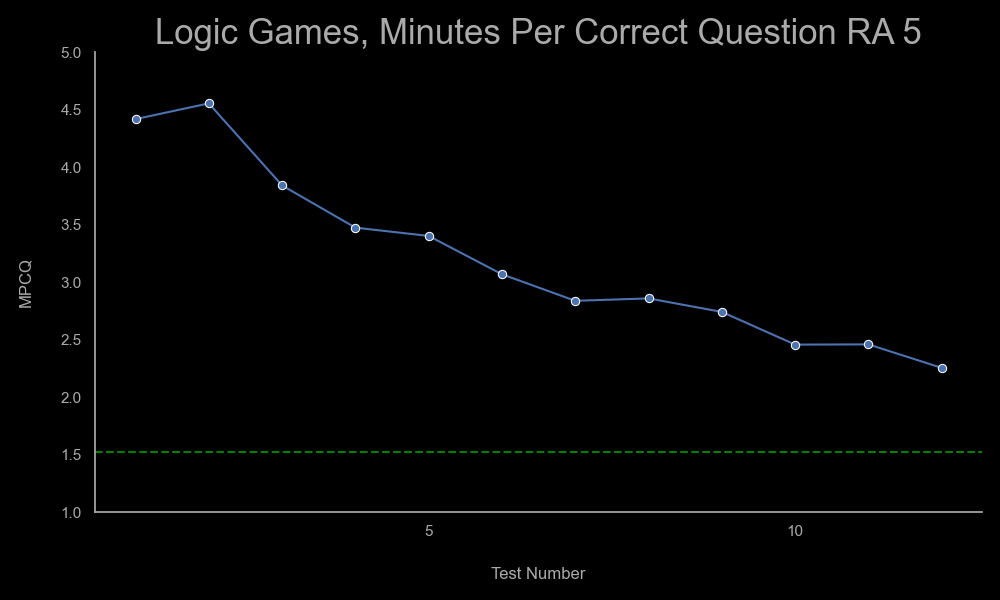
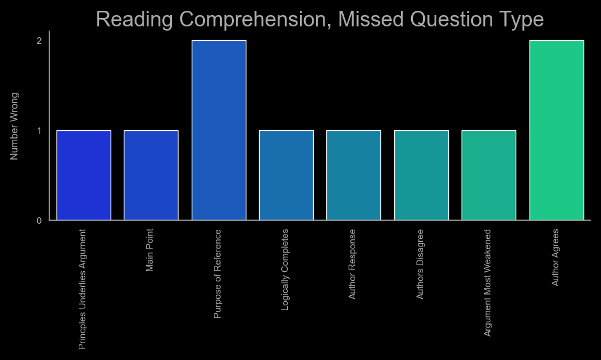
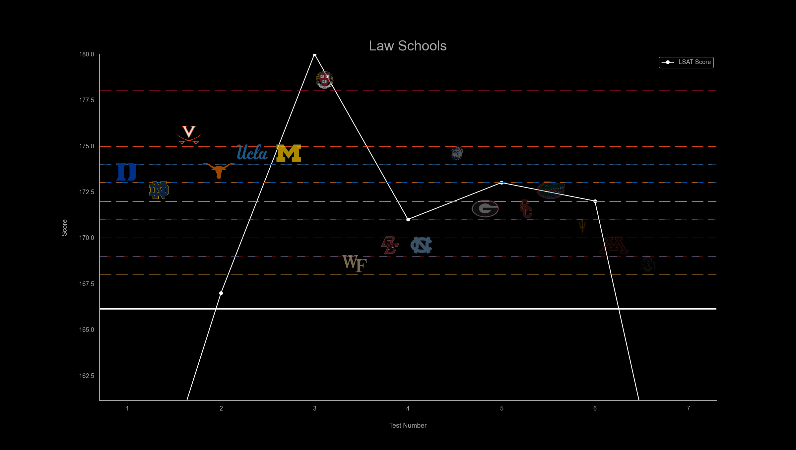

# 69Sage

Developed for free use by Brady Kruse. Please note that this code is not intended for malicious use by either me or the user, and the code is entirely open-source and available to view in its entirety by the public. 

I'm not a lawyer (yet), but I still make absolutely no guarantees about this code, including, but not limited to, the ability of this code to successfully run, the usefulness of the metrics generated by this code, any impact using this code may or may not have on your LSAT score, the ongoing availability of this code, any potential updates to this code, or any risk (physical, emotional, cyber, or otherwise) associated with using this code. By downloading this repo, you are assuming complete responsibility for any impacts that using this code may or may not provide. 

## Introduction

I think it is complete and total bullshit that a prospective student is expected to pay hundreds, if not thousands, of dollars to prepare for a standardized test. Top LSAT study tools and tutors are extremely expensive, therefore, I wrote some Python code to generate similar insights as to what another service may provide.

Please note that this is NOT as convenient or insightful as a professional tool would be. However, it might be (at least a little) helpful and it is entirely free. Your results may vary.

The code here does not include any LSAT questions or tests (or else I would 100% go to jail for copyright infringement). I suggest purchasing plenty of the PrepTests found [here](https://www.lsac.org/lsat/lsat-prep/prep-books-ebooks)

Furthermore, I also wholeheartedly recommend [Mike Kim's LSAT Trainer](https://www.amazon.com/LSAT-Trainer-Remarkable-Self-Study-Self-Driven/dp/0989081559/ref=sr_1_1?crid=6KMKHLQ004H7&keywords=mike+kim+lsat+trainer&qid=1688927734&s=books&sprefix=mike+kim+lsat+trainer%2Cstripbooks%2C80&sr=1-1) for learning question types and diagramming technique.

These graphs are most useful if you follow the general advice to, at first, not worry about time. Go as fast as you are comfortable. Over time, your speed will naturally increase.

## Python Installation

This will be the trickiest part of the whole installation process, but don't worry, there is no need for an intense technical background.

If you're on Mac or Linux, you probably already have Python installed. Open up Terminal (on Mac you can find it via LaunchPad, if you're on Linux...I assume you know how to open a terminal). Then run:

`python --version`

If you get an output (something like `Python 3.10.9`), you're good to go. As far as I know, none of the libraries I use in the code require a specific version of Python3. If you get an output that is LESS than Python3, try running:

`python3 -- version`

If that doesn't work, you'll need to install Python3. If that does work, then, for all subsequent instructions, just replace `python` with `python3`.

If you don't get an output or you are on Windows, I suggest following [this guide](https://realpython.com/installing-python/) to get set up. Make sure to tick the "add Python to PATH" option. This allows you to run Python scripts by typing `python` in CMD.

## Download

On this page, click the Green "Code" button near the top and then "Download ZIP". Save it somewhere convenient (I'll use desktop in the next few instructions) and unzip the folder.

## Navigate to 69Sage

On Mac or Linux, open terminal and run:

`cd Desktop/69Sage`

Or wherever you saved it, e.g. `cd /Desktop/Files/69Sage` or `cd /Downloads/69Sage`. If you're not familiar with navigating file systems, I suggest just saving it to your desktop.

On Windows, open CMD and run:

`cd Desktop\69Sage` 

Or wherever you saved, same as above. Keep in mind that Windows uses `\` rather than `/` to denote directories.

Now, your terminal or CMD is working in the 69Sage directory and can find all the correct files.

## Install Additional Libraries

69Sage uses lots of really cool, open-source libraries to create pretty graphs. You'll have to install them as well. Don't worry--this is very common and easy.

While in the 69Sage directory, run the following command in your terminal.

`python -m pip install -r requirements.txt`

That's it! Your terminal screen will get flooded with a bunch of progress bars for a few seconds, and then everything will be installed. 

I've occasionally gotten errors related to "pip's dependency resolver" depending on the Python version, but the code still seems to work fine. Your mileage will vary but don't be alarmed if you see an error.

## Inputting Your Data

In your file explorer, open up the "data" folder. In it, you'll find several (hopefully self explanatory) Excel files. This is where you input your data. I've left some dummy data in each file, so it should be pretty self explanatory. Do *not* change the name of the file or leave incomplete rows--the code will currently break.

Unfortunately, I opted to use Excel files instead of .CSVs because Excel files can have multiple sheets. If you don't have Excel, I'd suggest using Google Sheets, exporting as Excel, renaming the files to follow this *exact* naming convention, and then placing them in this folder. 

As you enter new data, enter from the last entry in the file. Do not start at the top (except to delete my dummy data).

### lsat_scores.xlsx

Pretty self-explanatory. "Test Number" is the actual PrepTest number, the score is...well...your score.

### scores_times_lg.xlsx

"Questions Wrong" is how many you missed, "Time" is how much time you took, and "Total Questions" is how many questions were in the section (some earlier sections had only 23 questions)

### scores_times_rc.xlsx & scores_times_lr.xlsx

Same as the LG sheets, EXCEPT there is an additional entry for "Missed Question Type." These acronyms correspond to the "Key" sheet below. Not all question types are currently represented in the "Key". When you miss a question, check if it already exists in the "Key" sheet. If not, add the entry. Input the acronyms for the missed questions, sepearated by commas, into the "Missed Question Type" column. Feel free to adjust the "Key" as you'd like--I know that each study service labels question types differently.

### schools.xlsx

Enter all the schools you're interested in *in order of your interest*, an ideal LSAT score for applying (I took 75th percentile + 2), the school color as a HEX value (you can just google "Duke Blue Hex" e.g.), and, *most importantly*: use Google images to find a *.png* of the school logo on a transparent background, download the file and name it whatever you'd like, enter that name in the sheet, and drop the .*png* in the "images" folder.

## Running the Code

Now that you're finally set up, time to see some results. While in the 69Sage directory in your terminal, just run:

`python 69sage.py`

If you have a different time limit and / or would like to adjust the "ideal questions wrong" (more on that below), you can run:

`python 69sage.py -t [time limit] -m [max questions missed]`

For example:

`python 69sage.py -t 53 -m 3`

will generate results based on a time limit of 53 minutes and an max questions missed of 3 per section.

## Results

After running the code, open the "results" folder. In it, you'll see today's date. Open that folder and you'll find the graph outputs. The code will create new graphs based on the day you run it so you can compare over time. If you run the code twice on the same day, the new graphs will overwrite and delete the old ones for the same day. 

I've also left example graphs for 2023-07-09.

### time_v_qw

This graph shows your time vs. questions wrong for each attempt. The bubbles move from blue to teal chronologically, i.e. your latest attempt will be the most teal and your first will be blue. The green dotted line represents your time limit, the red dotted line represents your max questions wrong to acheive the score you want. For example, to get my desired score of 173+, ideally I'd miss no more than 2 questions per section for a total of 8 missed questions. Over time, the tealer bubbles should congregate in the bottom left corner.

### mpcq

This graph shows your "minutes per correct question," i.e. total time / total number of correct questions per section. This is a useful but imperfect metric. It's very useful *before* you are under time, giving you an idea of your progress and helping you gauge how many questions you can realistically get right at your current pace. However, it also has clear limitations. First, not every question is the same, though the law of averages will eventually cancel some of this out. Second, it can be easily skewed. If you finish a section with 10 minutes to spare but miss several questions, your MPCQ will be better than a "perfect" score (represented by the green line: Time Limit / Total Number of Questions).

I've also included rolling averages in `mpcq_ra.png` and `mpcq_ra5.png`. The  former shows your rolling average across ALL tests. The latter, your most recent 5. I think the latter is a much better metric for evaluating your current performance.

### missed_q.png

These charts are simple bar charts that show which question types you tend to get wrong the most. Unfortunately, their use is a little limited without actually knowing the frequency of the questions. Is it bad if I miss a certain question type 100% of the time if it only shows up 1 out of every 10 tests? Is that worth my time to study? I intend to create some new graphs that are scaled in this way soon, but need to collect the data first.

Note, I also only created these graphs for LR and RC. I find them less useful for LG because, in LG, there is ALWAYS only ONE right answer and the rest MUST be false. LR and RC rely on more subjectivity based on the question type.

### lsat_scores.png

This is my favorite graph because it motivates you, as prospective student, by giving you clear goals to shoot for. It's a simple lineplot that shows you your LSAT scores over time, overlayed over the schools you want to attend. Each dotted line is color-coded by school (even will be multicolor if multiple schools have the same ideal score) and identified by the school logo. Each school also has a transparency value--the school you are LEAST interested in (sorry Ohio State) is very faded, while the school you love the most (Let's Go Duke) is in full color and pops out to you. 

Your current average is the thick white line. Note that this is the average across ALL tests in the `lsat_scores.xlsx` file. If you want to see, say, your past 10 tests, you'll have to delete the other entries (and store them elsewhere.)

## Wrapping Up

And that's it! As I said before, this is NOT 7Sage levels of convenience or analysis. However, it's better than nothing and is completely free to you. If it helps you, I'm glad to hear it. If it doesn't, no hard feelings. 

I intend to continue creating metrics, graphs, improve user experience, etc. in my free time. If you have realistic suggestions / thoughts, shoot me a DM on Reddit at Fireblade09.

